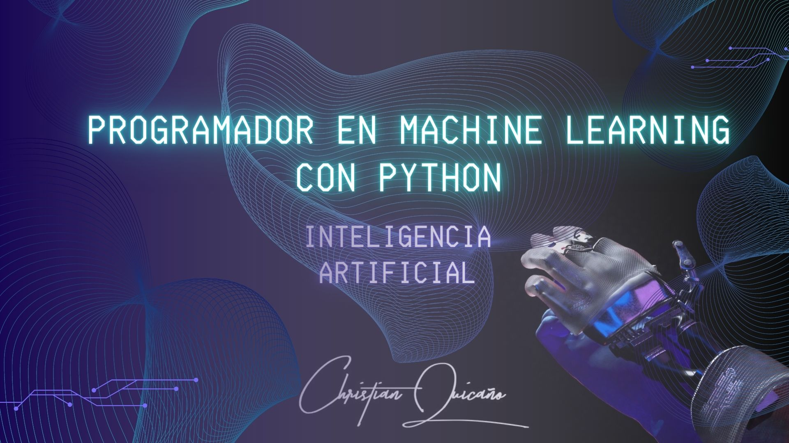

# Curso online: Programador AI en Machine Learning con Python 2024 español

## Academia Inteligencia Artificial

Continúa tu futuro profesional con nosotros, accediendo a nuestro campus virtual desde tu ordenador o dispositivo y aprendiendo de manera 100% práctica como si estuvieras en un aula presencial.

Ser especializados nos da una serie de ventajas y potenciar nuestras metodologías, ya que nos concentramos en investigar constantemente las tendencias mundiales que impartimos en nuestros cursos para convertirte en un experto..

## Visitanos en

https://academiainteligenciaartificial.com/

## License

Para las personas que compraron el curso de forma online

## Propiedad intelectual de

Magister en Inteligencia Artificial Christian Quicano
